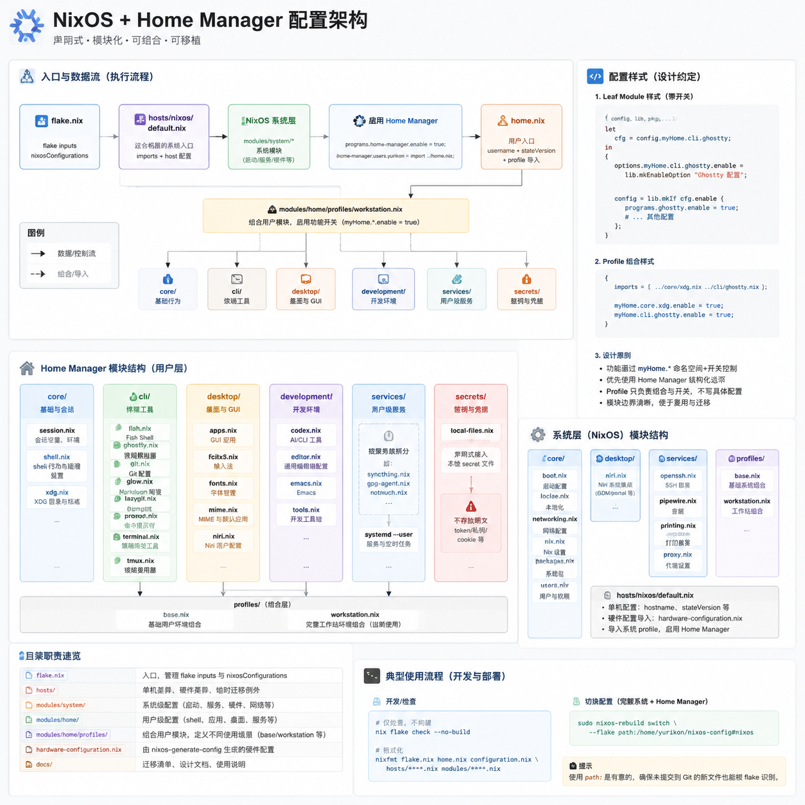

# NixOS 配置

这个仓库是 Yurikon 这台 NixOS 工作站的声明式配置。它用一个 flake 同时管理：

- NixOS 系统级配置
- Home Manager 用户级配置

这台机器从 Arch Linux 迁移而来。迁移时使用的备份位于仓库外：

```text
/run/media/yurikon/Momonga/MyData/Backup/nixos-migration-2026-05-28/
```

备份只作为参考资料使用。不要把运行时状态、缓存、token、私钥、浏览器会话、
生成数据库等内容复制进这个仓库。

## 架构图



## 配置入口

```text
flake.nix                   flake inputs 和 nixosConfigurations.nixos。
hosts/nixos/default.nix     这台机器的系统入口。
home.nix                    yurikon 用户的 Home Manager 入口。
configuration.nix           兼容入口，只 import hosts/nixos。
hardware-configuration.nix  由 nixos-generate-config 生成的硬件配置。
```

当前推荐的系统入口是 `hosts/nixos/default.nix`。根目录的 `configuration.nix`
只是为了从 `/etc/nixos` 迁移过来时更容易理解；新的系统配置通常应该放到
`modules/system`。

## 目录结构

```text
hosts/
  nixos/             单台机器的 imports 和 host-only 配置。

modules/
  system/
    core/            启动、Nix 设置、locale、用户、基础系统包。
    desktop/         桌面会话的系统级集成。
    services/        PipeWire、OpenSSH、打印等系统服务。
    profiles/        系统模块组合。

  home/
    core/            XDG、shell/session、稳定的用户默认行为。
    cli/             终端工具和命令行工作流。
    desktop/         GUI 应用、字体、MIME、fcitx5 和桌面会话配置。
      sway/config    原生 Sway 配置，由 Home Manager 安装。
    development/     Emacs、Codex、Pi 和全局开发工具。
      emacs/         原生 Emacs init.el 与 early-init.el。
    secrets/         sops-nix 与本地 secret hook；不存放 secret 明文。
    profiles/        Home Manager 模块组合。

secrets/
  user.yaml          sops 加密后的用户 secret。
```

## 常用命令

切换完整系统配置，包括 Home Manager：

```sh
sudo nixos-rebuild switch --flake path:/home/yurikon/nixos-config#nixos
```

只检查求值，不实际构建：

```sh
nix flake check --no-build path:/home/yurikon/nixos-config
```

格式化 Nix 文件：

```sh
nixfmt flake.nix home.nix configuration.nix hosts/**/*.nix modules/**/*.nix
```

这里使用 `path:` 是有意的。工作区存在尚未加入 Git 的新模块或配置文件时，普通
Git-backed flake 会使用 Git 视角，可能看不到未跟踪文件。

## 系统配置

系统模块使用 `mySystem.*` 命名空间，并通过 feature flag 启用。一个 leaf
module 通常长这样：

```nix
{ config, lib, pkgs, ... }:

let
  cfg = config.mySystem.services.example;
in
{
  options.mySystem.services.example.enable =
    lib.mkEnableOption "example system service";

  config = lib.mkIf cfg.enable {
    services.example.enable = true;
  };
}
```

系统功能在 `modules/system/profiles/workstation.nix` 中启用。只属于这台机器的
配置，例如 `networking.hostName`、`system.stateVersion`、硬件配置 import，
放在 `hosts/nixos/default.nix`。

## Home Manager

Home Manager 模块使用 `myHome.*` 命名空间。`home.nix` 应保持很小，只设置：

- 用户名
- home 目录
- Home Manager stateVersion
- workstation profile import

用户功能在 `modules/home/profiles/workstation.nix` 中启用。leaf module 优先使用
Home Manager 的结构化选项，例如 `programs.*`、`services.*`、`xdg.configFile`、
`home.file`。

当前全局编辑器是 Emacs。项目专属的 LSP、编译器、SDK、formatter 应优先放到项目
自己的 `flake.nix` 或 `devShell` 中。全局只保留通用的 Nix 和 shell 维护工具。

Emacs 采用“管理模块 + 原生配置文件”的结构：

```text
modules/home/development/emacs.nix         软件包、服务和 Home Manager 接入。
modules/home/development/emacs/init.el     Emacs 主配置。
modules/home/development/emacs/early-init.el
```

## 桌面环境

目标桌面是 Sway。当前取舍是：使用 Sway 时放弃 Noctalia，保留简洁、高效、可扩展、
阅读负担低的桌面组织方式。Niri/Noctalia 模块仍保留为可回退参考，但 workstation
profile 不启用它们。

Sway 的系统级集成位于：

```text
modules/system/desktop/sway.nix
```

这里负责启用 Sway、greetd 登录入口、常用 Wayland 工具、power/bluetooth 相关服务。

Sway 的用户级配置也采用与 Emacs 相同的“管理模块 + 原生配置文件”结构：

```text
modules/home/desktop/sway.nix     软件包、脚本、Waybar、Kanshi、Mako 和 systemd 用户服务。
modules/home/desktop/sway/config  输入、输出、窗口行为、快捷键、工作区和窗口规则。
modules/home/desktop/lockscreen.nix
```

`sway/config` 使用原生 Sway 语法，Home Manager 在构建时注入终端、启动器和 home
目录的 Nix 路径，校验后安装为 `~/.config/sway/config`。因此日常整理 Sway 行为时
应编辑仓库内的文件，不要直接修改 Home Manager 生成的目标文件。

Sway 内置 `swaybar` 已关闭，当前使用 Home Manager 的 `programs.waybar`。Mako
负责通知，Fuzzel 负责应用启动与电源菜单，Kanshi 负责输出切换，Workstyle 负责按
窗口内容重命名 workspace。

当前显示器布局：

- docked profile：启用 `DP-1`，使用 `2560x1440@165Hz`、`scale = 1.25`、位置
  `0 0`，并关闭 `eDP-1`。
- mobile profile：外屏不存在时启用 `eDP-1`，使用 `2560x1600@120Hz`、
  `scale = 1.6`、位置 `0 0`。
- workspace 不再固定到特定输出；Kanshi 切换输出时由 Sway 自动迁移，避免留在已关闭
  的显示器上。

窗口策略保持极简：平铺窗口没有 gaps，也没有边框；单窗口占满可用区域。浮动窗口保留
边框，方便识别。

Waybar 位于屏幕顶部，高度为 24 像素：

- 左侧：workspace 和当前 mode。
- 中间：当前窗口标题。
- 右侧：空闲抑制、tray、网络、蓝牙、音量、内存、电池、时间和电源菜单。

workspace 显示由 Workstyle 优化。Workstyle 会监听 Sway 窗口变化并重命名 workspace，
用短字符表示当前 workspace 里的应用，例如终端 `T`、浏览器 `W`、编辑器 `E`、
FLClash `C`、Steam `S`。Waybar 直接显示 Workstyle 生成的 workspace 名称。

FLClash、Steam 等托盘程序优先通过 Waybar 的 `tray` 模块承载。为避免 FLClash
单实例进程在窗口被杀后无法重新打开 GUI，`Mod+Shift+q` 不再直接 kill FLClash
窗口，而是把它移动到 scratchpad；`flclash.desktop` 被覆盖为调用 `flclash-gui`。

锁屏由独立的 Home Manager 模块管理：空闲 5 分钟启动 `swaylock-effects`，10 分钟
关闭输出，恢复活动时重新打开输出；系统休眠前也会先锁屏。

截图快捷键：

- `Ctrl+Shift+Mod+4`：区域截图，保存到 `~/Pictures/Screenshots` 并复制到剪贴板。
- `Alt+Ctrl+Shift+Mod+4`：全屏截图，保存并复制到剪贴板。
- `Print`：全屏截图，保存并复制到剪贴板。
- `Shift+Print`：区域截图并打开 `swappy` 标注。
- `Ctrl+Print`：当前窗口截图，保存并复制到剪贴板。

GNOME Desktop 有意不启用。当前使用 greetd/tuigreet 作为登录入口，默认进入 Sway
session。

## 迁移规则

继续从备份迁移内容时，先分类再加入仓库：

- 系统启动、用户、服务、硬件、网络：放入 `modules/system`。
- shell、终端工具、编辑器配置、用户应用：放入 `modules/home`。
- 单机特有配置和临时迁移例外：放入 `hosts/nixos`。
- 运行时状态、缓存、日志、socket、history：默认不纳入管理。
- token、credential、私钥、cookie、密码库：绝不提交。
- 项目专属 LSP、SDK、编译器、formatter：放到项目 flake。

模块命名应使用语义名称，例如 `cli/git.nix`、`desktop/fonts.nix`、
`services/pipewire.nix`。避免使用 `misc.nix` 这类无法表达边界的名字。

## Secrets

`modules/home/secrets` 只描述 secret 的解密和加载方式，不存放 secret 明文。加密后的
数据保存在 `secrets/user.yaml`，由 sops-nix 使用本机 age key 解密；age 私钥位于：

```text
~/.config/sops/age/keys.txt
```

Home Manager 会生成 shell hook：

```text
~/.config/secrets/api-keys.bash
~/.config/secrets/api-keys.fish
```

这些 hook 只引用 sops-nix 在运行时生成的 secret 路径。age 私钥、解密后的内容和任何
临时明文都属于本机状态，必须留在 Git 外；仓库中只允许提交 sops 加密文件。

## 备注

`hardware-configuration.nix` 由 `nixos-generate-config` 生成。它应该保持小而专注，
只放硬件和文件系统相关配置。如果某个设置是可复用策略，而不是硬件检测结果，就应
移动到 `modules/system` 的对应模块中。
